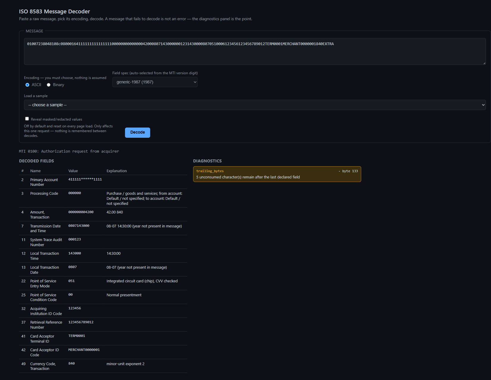

# ISO 8583 Message Decoder

Decodes ISO 8583 payment messages (ASCII and binary/BCD) into readable fields
with plain-language explanations and troubleshooting diagnostics. Built for
payments support and fintech engineering work: authorization, financial,
reversal, and network-management message traffic.

[](https://github.com/Abdul-Qadir-Dev/iso8583-decoder/actions/workflows/ci.yml)
[](LICENSE)

**Live demo:** _not deployed yet -- see [Deploy](#deploy) below_
<!-- TODO: replace the line above with the deployed URL once it exists -->



## Architecture

Decoding is a fixed pipeline, not one function, and each stage is a separate
module with one job:

```
raw message
    |
    v
mti.py        -- structural MTI decode (version/class/function/origin from
    |             digit position). Also picks which field spec to load.
    v
bitmap.py     -- primary/secondary bitmap -> list of present field numbers.
    |             Identical code path for ASCII and binary mode.
    v
extract.py /  -- reads each present field's raw value per its spec entry.
binary_extract.py   ASCII mode reads characters; binary mode BCD-unpacks.
    |
    v
parser.py     -- wires the three stages together into one DecodeResult,
                  collecting Diagnostics from all of them.
```

Two more layers sit on top of a `DecodeResult`, both optional and neither one
touches the parse itself:

- **render.py** -- turns a decoded value into safe displayed text (masking,
  redaction). The only place that happens.
- **explain.py** -- turns a decoded value into a plain-language string
  (response code meanings, formatted amounts, formatted dates). Lazy, called
  only when asked for.

`api.py` (FastAPI) and `web/index.html` (the UI) are thin callers on top of
all of this -- they compose `parser` + `render` + `explain`, they don't
reimplement any of it.

**The spec/YAML boundary:** nothing about a specific field layout, value
meaning, or exchange rate table is a Python literal. `spec/*.yaml` defines
per-processor field layouts (currently one: `1987_generic.yaml` -- a
different processor's layout is a new YAML file, not new code).
`spec/mti_meanings.yaml` and `spec/processing_code_meanings.yaml` hold
ISO-8583-standard-level value maps. `data/iso4217_exponents.yaml` holds the
currency exponent table. `samples/messages.yaml` holds the sample library.
`iso8583_decoder/spec.py`'s Pydantic models are what load and validate all
of it.

## Design decisions

**Encoding is explicit, never sniffed.** `decode_message()` and `POST
/decode` both require an `encoding` argument with no default. An ISO 8583
message doesn't self-identify whether it's ASCII or binary/BCD, so guessing
from content would produce a plausible-looking wrong decode instead of an
obvious failure -- exactly the class of bug this tool exists to catch, not
create.

**Two failure mechanisms, kept separate.** A `Diagnostic` means something is
wrong but the byte offset is still known, so decoding continues. A partial
result means the offset became untrustworthy, so extraction stopped, with
`stopped_at` and `reason` recorded. Both can appear in the same result -- a
message can accumulate several diagnostics and then hit a stop. Conflating
the two would either hide a real anomaly behind an apparently-complete
decode, or throw away everything already read past the first problem.

**Sensitivity is spec data; masking is a render-layer concern.** Which
fields are sensitive, and how, is declared per field in the YAML spec
(`sensitivity`, `mask_strategy`), not hardcoded by field number in code.
Masking itself happens only at the render layer -- the parser always carries
the true value -- so the decoded-field table, the diagnostics panel, and
error messages all inherit the same rule instead of each having to remember
to apply it. Reveal is explicit opt-in, off by default, threaded through as
a request parameter rather than a setting someone can forget is on.

## Setup

Requires Python 3.11.

```bash
git clone https://github.com/Abdul-Qadir-Dev/iso8583-decoder.git
cd iso8583-decoder
python -m venv .venv
source .venv/bin/activate      # Windows: .venv\Scripts\activate
pip install -r requirements-dev.txt
pytest -q
```

Run the API and UI locally:

```bash
uvicorn iso8583_decoder.api:app --reload
```

Then open `http://localhost:8000` for the UI, or `http://localhost:8000/docs`
for the interactive API docs.

## Current limitations

- Fields 48, 55, and 60-63 (private-use data and EMV TLV) aren't in the
  loaded spec. If a message sets one of those bitmap bits, decoding flags a
  `bitmap_field_not_in_spec` diagnostic and, if extraction reaches that
  field, **stops there** -- these fields aren't shown as an uninterpreted
  raw dump, decoding of the rest of the message halts.
- The tertiary bitmap (bit 65 in the secondary bitmap) is recognized and
  flagged (`bitmap_tertiary_bit_set`) but never parsed -- fields 129-192 are
  out of scope.
- Only the 1987 generic field spec ships. The MTI version digit is decoded
  structurally for 1993/1998/private-use too, but there's no field spec
  mapped to them yet, so a message using one raises `UnsupportedVersionError`
  (surfaced as a normal `200` with `reason_code: mti_version_unsupported`
  through the API, not an HTTP error).
- The API has no authentication and isn't intended for production or public
  exposure as-is -- see `iso8583_decoder/api.py` and the Deploy section
  below.

## Deploy

`Dockerfile` and `render.yaml` are set up for [Render](https://render.com):
a free web-service tier, Docker-native, deploys straight from a connected
GitHub repo, and (last checked) doesn't require a card on file for the free
tier -- a reasonable fit for a small stateless demo API like this one.

Steps to run yourself (account creation isn't something this tool does on
your behalf):

1. Push this repo to GitHub, if it isn't already.
2. Create a free account at [render.com](https://render.com).
3. **New +** -> **Web Service** -> connect this GitHub repo.
4. Render should detect `render.yaml` automatically (Blueprint). If not, set
   the environment to **Docker** manually and leave build/start commands
   blank -- the `Dockerfile` handles both.
5. Deploy, and wait for the build to finish.
6. Visit `https://<your-service>.onrender.com/health` and confirm it returns
   `{"status": "ok"}`.
7. Paste that URL into the "Live demo" line near the top of this README.

The free tier sleeps after a period of inactivity; the first request after
that can take a few seconds while it wakes up.

## Provenance

Built from the public ISO 8583 specification, not derived from any
employer's internal implementation. Sample messages use standard,
publicly-documented test PANs (`4111111111111111`, `5555555555554444`), not
real card or merchant data.

## License

[MIT](LICENSE).
